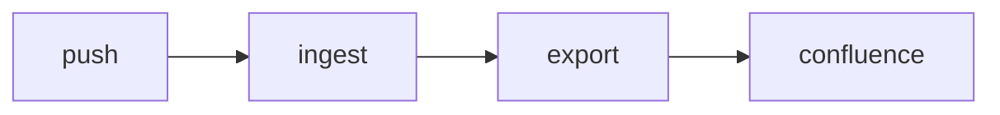

<!-- markdownlint-disable-file MD025 MD041 -->

# RFC-0002: Render everything

<!--toc:start-->
- [Summary](#summary)
- [Problem Statement](#problem-statement)
  - [Supporting Data](#supporting-data)
- [Proposed Solution](#proposed-solution)
  - [Links](#links)
  - [Diagram](#diagram)
  - [Table](#table)
  - [Tasks](#tasks)
  - [Code](#code)
- [Alternatives Considered](#alternatives-considered)
- [Risks and Mitigations](#risks-and-mitigations)
- [Success Criteria](#success-criteria)
- [References](#references)
<!--toc:end-->

<!--docz:summary:start-->
## Summary

<!-- Brief 2-3 sentence summary of the proposal -->

<!--docz:summary:end-->

<!--docz:problem:start-->
## Problem Statement

<!-- What problem does this RFC address? Include supporting data, evidence and impact. -->

### Supporting Data

<!-- Data gathered that support the proposed solution. -->

<!--docz:problem:end-->

<!--docz:proposal:start-->
## Proposed Solution

Every construct the Confluence renderer handles, in one document.

### Links

- To another exported document: [ADR-0001](../adr/0001-record-a-fixture-decision.md)
- To a file that is not exported: [the check script](../../scripts/check.sh)
- To nothing at all: [a missing page](../missing.md)

### Diagram



### Table

| Case | Expected |
| ---- | -------- |
| link to a document | a page link |
| link to a file | a GitHub blob URL |
| link to nothing | an unresolved link in the report |

### Tasks

- [x] Render a task list
- [ ] Leave one open

> [!NOTE]
> Alerts become info panels.

### Code

```go
fmt.Println("hello, confluence")
```

<!--docz:proposal:end-->

<!--docz:alternatives:start-->
## Alternatives Considered

<!-- What other approaches were evaluated and why were they rejected? -->

<!--docz:alternatives:end-->

<!--docz:risks:start-->
## Risks and Mitigations

| Risk | Impact | Likelihood | Mitigation |
| ---- | ------ | ---------- | ---------- |
|      |        |            |            |

<!--docz:risks:end-->

<!--docz:criteria:start-->
## Success Criteria

<!-- How will we measure whether this RFC achieved its goals? -->

<!--docz:criteria:end-->

<!--docz:references:start-->
## References

<!-- Links to related ADRs, RFCs, issues, external docs -->

<!--docz:references:end-->
